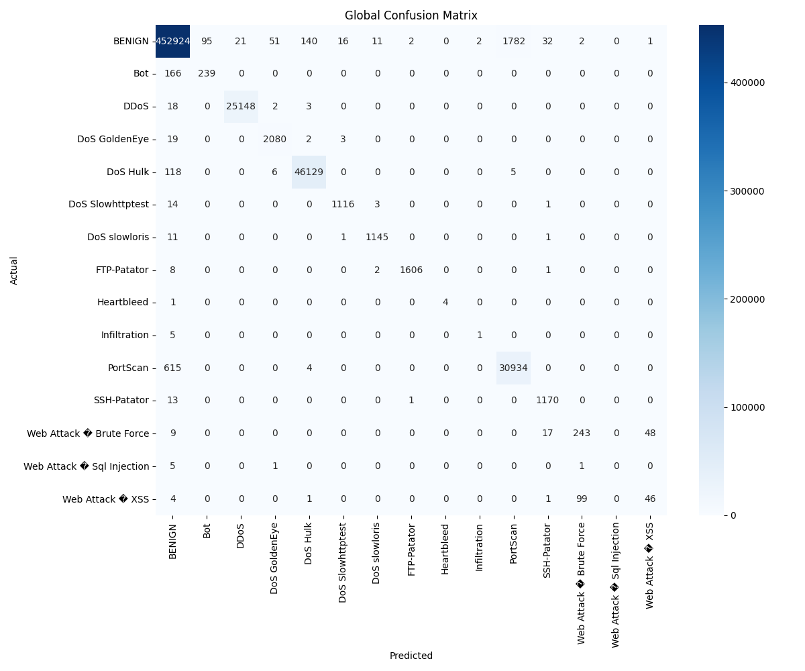

## Project Overview

The project, titled "Detecting Cyber Threat Events with Bi-directional LSTM CNN Model," aims to address the critical challenge of rapidly evolving DDoS attacks that are becoming increasingly sophisticated and difficult to detect with traditional security measures. By utilizing advanced machine learning techniques, this initiative seeks to develop an adaptive system capable of identifying and mitigating DDoS threats in real-time network traffic. This approach not only aims to enhance the accuracy of DDoS attack detection but also significantly reduces the incidence of false positives and negatives, thereby improving the security posture of networked systems against such disruptive cyber threats.

### Team Members

* Sean Sica

## Problem Statement

In today's digital landscape, Distributed Denial of Service (DDoS) attacks represent a formidable challenge for network security, characterized by their ability to evolve rapidly and elude traditional defense systems. These attacks disrupt service availability, causing significant downtime and financial repercussions for affected businesses. Traditional defense mechanisms are often inadequate in effectively handling the complexity and variability of contemporary DDoS tactics. As these attacks continue to grow in sophistication, there is a pressing need for more advanced and dynamic methods of detection and mitigation.

## Objective

The primary goal of this project is to develop a state-of-the-art machine learning model that excels in detecting DDoS attacks within network traffic. This model aims to achieve high accuracy with a strategic focus on minimizing both false positives (erroneous threat detection) and false negatives (missed threats). By surpassing the capabilities of traditional detection approaches, the model will provide a more reliable and adaptive solution for combatting the evolving landscape of DDoS threats. This endeavor not only aims to protect network infrastructures but also seeks to reduce the operational and financial impacts of these disruptive cyber incidents.

## Approach/Methodology

### Exploratory Data Analysis

Initial exploratory data analysis (EDA) was conducted in a Jupyter Notebook environment (Google Colab). This involved studying the CIC-IDS2017 dataset and determining a feasible approach for feature engineering. A variance distribution was computed and plotted to aid with identifying any obvious signs of patterns or discrepancies in the features.

#### Null Values

Each column was checked for the presence of null values. The only column containing null values is "Flow Byte(s)", totaling 1358 instances. The "Flow Bytes(s)" feature represents the rate at which bytes are transmitted over a network during a specific flow. A flow is as a sequence of packets sent from a source to a destination, characterized by attributes like IP addresses, port numbers, and protocol.

Before deciding on how to handle the null values, additional investigation was done in the context of other features. For example, checking the "Flow Duration" might offer insights: flows with very short durations might explain the nulls.

It was discovered that all samples with null "Flow Byte(s)" have a flow duration of 0, suggesting that these flows are instantaneous and do not last any measurable amount of time. In the context of network traffic, a flow duration of 0 could mean that the flow was initiated and terminated within the same timestamp unit for measurement, thus not allowing for a rate (flow bytes) to be calculated.
  
The total_fwd_packets and total_backward_packets statistics show that, on average, there are about 1-2 forward packets and very few (if any) backward packets. This suggests minimal to no response or acknowledgment packets in these flows, which aligns with the instantaneous nature of these flows.

Given this context, the null flow_bytes/s values *appear* to be a natural consequence of the flow_duration being 0, rather than missing data due to recording errors. Therefore, simply imputing these nulls with a mean or median could introduce bias or inaccuracies. Since these flows are instantaneous and have no duration, it might make sense to set flow_bytes/s for these records to 0. This directly reflects the fact that, over the zero duration, no bytes were transmitted per second.

The research paper accompanying the CIC-IDS2017 dataset was reviewed before making a final determination. The paper states that Flow Inter arrival time (IAT) related features such as Min, Mean, Max and also the Flow Duration are the best common features for DoS detection. Notably, for DDoS attack, backward packet length, average packet size and some inter arrival time related features are heavily influential features.

```{r echo=FALSE, out.width = "100%", fig.show='hold', fig.align='center', fig.cap="Flow Duration Boxplot"}

```

Here are some observations and potential insights based on the boxplot:

* Variability in Duration: There is significant variability in the duration of flows across different categories. Some types of attacks, like DoS and DDoS, have wider interquartile ranges (IQR), indicating more variability within these categories.
* Long Duration Attacks: The categories like DoS Hulk and Heartbleed show a larger range of flow durations, including some extremely high values, which could indicate prolonged attack activities.
* Short Duration Traffic: On the other hand, categories such as BENIGN, Infiltration, and various Web Attacks have shorter flow durations, as indicated by the lower median and IQR, which might be typical of regular traffic or more stealthy attacks.
* Outliers: There are numerous outliers in almost all categories, especially in DoS Hulk and DDoS. This could indicate the presence of exceptionally long flows that could be due to either malicious activities or non-malicious but unusual network behavior.
* Median and Mean Duration: Categories with higher medians like DoS GoldenEye might imply a consistently higher flow duration characteristic of the attack, while others with lower medians but high variability (like DDoS) might be sporadic or bursty.

Future research on this dataset should consider the potential for feature engineering the flow duration, especially when considered in conjunction with other features like packet size and inter-arrival times. It could be used to engineer additional features that more effectively discriminate between benign and malicious traffic.

### Literature Review

A literature review was performed, which included reading the supporting paper published alongside the CIC-IDS2017 dataset. The researchers listed what they determined to be the best selected features and corresponding weight of each label category. Although they did not explicitly explain how they calculated the weights in Table 3 of the paper, they mentioned the use of `RandomForestRegressor`, suggesting that they likely used a feature importance technique.

An attempt was made to recreate their findings using a Random Forest Regression analysis with SciKit-Learn. While the exact results could not be replicated, likely due to differences in preprocessing steps and hyperparameters, the identified most important features were overall consistent with the researchers' findings and provided valuable insights.

Key insights from feature importances:

* Most influential features: `flow_bytes/s`, `total_length_of_fwd_packets`, `bwd_packet_length_std`, and `subflow_fwd_bytes` 
* Less influential features: `bwd_urg_flags`, various bulk rate features, and `fwd_avg_bytes/bulk` 
* Potential for dimensionality reduction to simplify the model without significantly impacting performance

### Feature Engineering

Feature engineering was carried out using a robust preprocessing module, structured following the builder software pattern to ensure flexibility and adherence to the DRY (Don't Repeat Yourself) principle. Below is an illustrative example of the preprocessing implementation:

```python
# Initialize the preprocessor using the PreprocessorBuilder
preprocessor = PreprocessorBuilder() \
    .with_data_cleaning(fill_method="median") \
    .with_correlated_feature_removal(correlation_threshold=self.correlation_threshold) \
    .with_pca(pca_variance_ratio=self.pca_variance_ratio) \
    .with_one_hot_encoding() \
    .build()  # returns a Preprocessor object

# Utilize the preprocessor in the BasePipeline
data_loader, X_preprocessed, y_encoded, label_mappings = self.initialize(
    preprocessor=preprocessor
)
```

#### Dimensionality Reduction

Initially, a correlation matrix was generated with a threshold of 90% to identify and remove redundant features. This analysis led to the elimination of 31 features that were highly correlated, simplifying the model without significantly affecting its performance. The removed features include 'subflow_bwd_packets', 'bwd_packet_length_mean', and 'fwd_iat_mean', among others.

```{r echo=FALSE, out.width = "50%", fig.show='hold'}

knitr::include_graphics("images/corr_matrix_after.png")
```

The feature set was initially reduced from 79 to 48. Subsequently, Principal Component Analysis (PCA) was applied, further reducing the feature count to 26 components while retaining 95% of the variance. For the final experiments, PCA alone was utilized with a higher correlation threshold of 95%, which effectively reduced the dataset to 24 dimensions:

```shell
$ dosdetect --bilstm-cnn-correlation-threshold 1.0
```

Following dimensionality reduction, data normalization and label encoding were performed, with labels ranging from 0 to 14 and being one-hot encoded, except for Logistic Regression. These preprocessing steps were managed by the `DataCleaner` module, which is also responsible for handling missing values by filling infinite and NaN values with the median by default. The use of the median fill method was selected with preliminary evidence suggesting its effectiveness; however, further exploratory data analysis is recommended to more thoroughly justify this choice and explore other potential methods.

### Baseline Models

After the EDA phase, primitive baseline models were run to set benchmarks for the Bi-LSTM-CNN model. The selected baseline models included: 

* K-Nearest Neighbors (KNN) 
* Random Forest 
* Logistic Regression
* Decision Tree
* Gradient Boosted Decision Tree
* Feed-Forward Neural Network (FFNN)
* Gated Recurrent Unit (GRU)

### Pipeline Scaffolding

During the development of our project, a substantial amount of effort was dedicated to creating a PyPi (wheel) application equipped with a command-line interface (CLI) that facilitates training, evaluation, and exporting of the Bi-LSTM-CNN model. Initially conceived as a straightforward utility for fast and repeatable model training, this application evolved into a robust tool capable of managing not only the Bi-LSTM-CNN but also baseline models such as KNN, Random Forest, and Logistic Regression from the SciKit-Learn suite.

This CLI application is designed with 23 configurable flags, primarily utilized to adjust or set various hyperparameters. It features an auto-tuning capability that employs KerasTuner to automatically find the best hyperparameters, which are subsequently saved to a file. This aids in replicating model evaluations accurately.

Key flags include:

- **`--dataset`**: This flag allows users to specify the path to the CIC-IDS2017 dataset, making the application adaptable to other sequential CSV datasets with a 'Label' classification feature.
- **`--train-fraction`**: Users can train the model on a subset of the original dataset, which proves invaluable during initial development and debugging phases.
- **`--log-dir`** and **`--model-dir`**: These flags are used to designate directories for storing logs, exported files (such as model parameters in .keras and .pkl formats), evaluated performances, and model details. By default, all pipelines create a unique directory within `~/.dosdetect` appended with a timestamp suffix.

The CLI further supports individual model configurations through additional flags specific to each model type:

- **Bi-LSTM-CNN Hyperparameters**:
    - Correlation threshold and PCA variance ratio are settable with defaults of 0.9 and 0.95, respectively, to control data preprocessing.
    - The number of epochs and batch size for training are customizable, with defaults of 10 epochs and a batch size of 32.

- **Random Forest Hyperparameters**:
    - Similar to Bi-LSTM-CNN, settings for correlation threshold and PCA variance ratio are provided.
    - The model configuration can be finely tuned with parameters like the number of estimators, maximum depth (with a default of `None` indicating unlimited growth of trees), and a random state.

- **Logistic Regression Hyperparameters**:
    - This model also uses correlation threshold and PCA variance ratio settings.
    - Parameters such as inverse of regularization strength (`C`), maximum number of iterations, and random state enhance the flexibility in model training and regularization strength to prevent overfitting.

- **Decision Tree Hyperparameters**:
    - Correlation threshold and PCA variance ratio settings are provided for data preprocessing.
    - The maximum depth of the tree, minimum number of samples required to split an internal node, minimum number of samples required to be at a leaf node, and the criterion for measuring the quality of a split (e.g., Gini impurity or entropy) can be configured.

- **Gradient Boosted Decision Tree Hyperparameters**:
    - Correlation threshold and PCA variance ratio settings control data preprocessing.
    - The maximum depth of the individual trees, learning rate for boosting, and the number of estimators (trees) can be specified, with defaults of 3 for max depth, 0.1 for learning rate, and 100 estimators.

- **FFNN Hyperparameters**:
    - Like other models, correlation threshold and PCA variance ratio settings are available.
    - The number of hidden units, dropout rate, and hidden layers can be customized, with defaults of 128 hidden units, 0.2 dropout rate, and 2 hidden layers.
    - The epochs and batch size for training are also configurable, with defaults of 10 epochs and a batch size of 32.

- **GRU Hyperparameters**:
    - Correlation threshold and PCA variance ratio settings control data preprocessing.
    - The number of GRU units, dropout rate, epochs, and batch size can be specified, with defaults of 128 units, 0.2 dropout rate, 10 epochs, and a batch size of 32.
    
Each of these flags is designed to provide granular control over the training and evaluation processes, ensuring that the models can be optimally configured for the best possible performance on the tasks at hand.

### Bi-LSTM Model Architecture

The model architecture consists of a combination of Bidirectional Long Short-Term Memory (Bi-LSTM) layers, a Convolutional Neural Network (CNN) layer, and fully connected (Dense) layers. Let's break down each component of the model:

#### Input Layer
The model starts with feeding the input data directly into the first LSTM layer. The input shape is determined by a configurable `input_shape` variable, which should be set according to the dimensions of the input features.

#### Bidirectional LSTM Layers
The model includes two Bidirectional LSTM layers. LSTM is a type of recurrent neural network (RNN) that can effectively capture long-term dependencies in sequential data. The Bidirectional wrapper allows the LSTM to process the input sequence in both forward and backward directions, enhancing the model's ability to capture contextual information. The first Bi-LSTM layer has a configurable number of units (ranging from 64 to 256 with a step of 64) determined by the hyperparameter tuning (hp) or set to a default value of 128. The second Bi-LSTM layer has a similar configuration but with a smaller range of units (32 to 128 with a step of 32) and a default value of 64. 

Notably, both Bi-LSTM layers have `return_sequences=True` to ensure that the output shape is compatible with the subsequent Conv1D layer. The output shape of the last LSTM layer would otherwise be (batch_size, units) and the subsequent Conv1D layer expects an input shape of (batch_size, timesteps, features). Toggling return_sequences on ensures that the output shape of the last LSTM layer is (batch_size, timesteps, units), which is compatible with the input shape expected by the Conv1D layer.

#### Convolutional Layer
Following the Bi-LSTM layers, a Conv1D layer is added to perform convolutional operations on the sequential data. The Conv1D layer applies a set of filters (configurable or default to 64) with a kernel size of 3 to extract local patterns and features from the Bi-LSTM outputs. The activation function used in this layer is ReLU (Rectified Linear Unit), which introduces non-linearity and helps the model learn complex patterns.

#### Flatten Layer
The Flatten layer is used to convert the 3-dimensional output of the Conv1D layer into a 1-dimensional vector. This step is necessary to prepare the data for the subsequent fully connected layers.

#### Dense Layers
The model includes two fully connected (Dense) layers. The first Dense layer has a configurable number of units (ranging from 32 to 128 with a step of 32) determined by hyperparameter tuning or set to a default value of 64. It uses the ReLU activation function to introduce non-linearity. The second Dense layer is the output layer, and its number of units depends on the type of classification task. Notably, support for both binary classification and multi-class classification. For binary classification, it has a single unit with a sigmoid activation function. For multi-class classification, it has `self.num_classes` units with a softmax activation function.

#### Dropout Layer
Between the two Dense layers, a Dropout layer is added to help prevent overfitting. Dropout randomly sets a fraction of the input units to 0 during training, which helps the model generalize better to unseen data. The dropout rate is configurable (ranging from 0.1 to 0.5 with a step of 0.1) or set to a default value of 0.5.

This Bi-LSTM-CNN model combines the strengths of recurrent neural networks (Bi-LSTM) for capturing long-term dependencies and convolutional neural networks (CNN) for extracting local patterns. The Bi-LSTM layers process the input sequence in both directions, the Conv1D layer captures local features, and the Dense layers perform the final classification. The model also includes hyperparameter tuning options to optimize the architecture for specific tasks. This combination of layers allows the model to effectively learn and classify sequential data, making it suitable for various applications such as text classification, sentiment analysis, or time series prediction.

### Pipeline Diagram

```{r echo=FALSE, out.width = "100%", fig.show='hold', fig.align='center', fig.cap="Training Pipeline"}

```

### Model Diagram

```{r echo=FALSE, out.width = "100%", fig.show='hold', fig.align='center', fig.cap="Bidirectional LSTM-CNN Model Architecture"}

```

### Datasets

This study utilized the CICIDS2017 dataset, a comprehensive collection designed to mirror a variety of real-world network traffic and attack scenarios, including Distributed Denial of Service (DDoS) attacks. This dataset is pivotal for training and evaluating our machine learning models, ensuring that they are tested against realistic network behaviors and attack patterns.

**CIC-IDS2017 Dataset Overview:**

- **Format:** The data is available in two formats:
  - **CSV:** Total size is approximately 880 MB, making it manageable for processing and analysis.
  - **PCAP:** Total size is 52.25 GB, providing extensive raw network traffic data that is ideal for in-depth forensic analysis.
- **Samples:** The dataset contains a total of 2,830,743 data points.
- **Features:** There are 79 features in each sample, encompassing a wide range of traffic attributes and derived statistics.
- **Data Types:** The features are primarily of integer (`int64`) and floating-point (`float64`) types, facilitating detailed numerical analysis.

**Data Split Ratios:**

To facilitate the training, validation, and testing of our models, we partitioned the data into distinct sets using the following ratios:

- **Training Set:** 60% of the data (`train_size=0.6`), used for fitting the models.
- **Validation Set:** 20% of the data (`val_size=0.2`), used for tuning the models' hyperparameters and making adjustments to model configurations.
- **Testing Set:** 20% of the data (`test_size=0.2`), used to evaluate the final performance of the models and ensure that they generalize well to new, unseen data.

## What is Considered Success/Failure?

-   **Success:** Achieving a detection accuracy of 95% or higher with a low rate of false positives and negatives, thus outperforming traditional detection mechanisms.
-   **Failure:** Inability to significantly outperform baseline methods or achieve a practical balance between detection accuracy and false positive rate.

## Evaluation Parameters and Experimental Setup

### Environment

The preliminary development of our models was performed on a machine equipped with an Apple Silicon M1 Pro chip, featuring:

- An 8-core CPU (6 performance cores and 2 efficiency cores)
- A 14-core GPU

We utilized the GPU capabilities of the machine for training all our Keras-based Bi-LSTM-CNN models due to their computational intensity. Conversely, our baseline models, developed using SciKit Learn, were trained on the CPU, as SciKit Learn does not natively support GPU training.

For final production-level training, we transitioned to a more robust setup:

- **Platform:** AWS EC2
- **Instance Type:** g5.12xlarge
  - **GPU:** 4 units
  - **vCPU:** 48 cores
  - **Memory:** 192 GiB
- **AMI:** Deep Learning OSS Nvidia Driver AMI GPU TensorFlow 2.15 (Ubuntu 20.04), version 20240410

### Bi-LSTM-CNN Results

The Bi-LSTM-CNN pipeline, optimized for DDoS attack detection, was executed using CUDA on our robust AWS setup. The process commenced at 15:08:21 on April 15, 2024, and concluded at 16:24:00, totaling approximately 1 hour and 15 minutes.

**Pipeline Configuration:**
The pipeline was configured with auto-tuning enabled and utilized the full dataset (train fraction set to 1.0). The correlation threshold was set to 1.0, with a PCA variance ratio of 0.95. Training involved 10 epochs and a batch size of 32, which were adequate given our computational resources and dataset characteristics.

**Model Hyperparameters:**
```json
{
    "input_shape": [25, 1],
    "num_classes": 15,
    "optimizer": {
        "name": "Adam",
        "learning_rate": "0.001",
        "beta_1": 0.9,
        "beta_2": 0.999,
        "epsilon": 1e-07,
        "jit_compile": true
    },
    "loss": "categorical_crossentropy",
    "metrics": ["loss", "accuracy"]
}
```

**Inference Performance:**
The model's performance metrics are detailed in the table below, showing its ability to classify various attack types with high accuracy. Notably, the model excelled in distinguishing benign traffic and DDos attacks, while showing some limitations in identifying less frequent attack patterns like Bot and Heartbleed, where both precision and recall were significantly lower.

| Class                     | Accuracy | Precision | Recall | F1 Score |
| ------------------------- | -------- | --------- | ------ | -------- |
| Benign                    | 97.99%   | 99.03%    | 98.47% | 98.75%   |
| Bot                       | 99.93%   | 0.00%     | 0.00%  | 0.00%    |
| DDos                      | 99.91%   | 99.81%    | 98.26% | 99.03%   |
| Dos GoldenEye             | 99.94%   | 96.47%    | 88.31% | 92.21%   |
| Dos Hulk                  | 99.26%   | 93.79%    | 97.39% | 95.56%   |
| DoS Slowhttptest          | 99.95%   | 86.06%    | 91.45% | 88.67%   |
| DoS Slowloris             | 99.96%   | 97.69%    | 80.40% | 88.20%   |
| FTP-Patator               | 99.97%   | 92.14%    | 97.84% | 94.90%   |
| Heartbleed                | 100.00%  | 0.00%     | 0.00%  | 0.00%    |
| Infiltration              | 100.00%  | 0.00%     | 0.00%  | 0.00%    |
| PortScan                  | 99.10%   | 89.36%    | 95.29% | 92.23%   |
| SSH-Patator               | 99.96%   | 86.66%    | 97.64% | 91.82%   |
| Web Attack: Brute Force   | 99.95%   | 100.00%   | 3.15%  | 6.12%    |
| Web Attack: Sql Injection | 100.00%  | 0.00%     | 0.00%  | 0.00%    |
| Web Attack: XSS           | 99.97%   | 0.00%     | 0.00%  | 0.00%    |

### Baseline Model Evaluation

#### KNN Results

The evaluation of the K-Nearest Neighbors (KNN) model was conducted efficiently, commencing on April 15, 2024, at 14:49:20 and concluding at 14:57:36, with a total duration of approximately 8 minutes and 16 seconds. The configuration for the KNN pipeline did not utilize auto-tuning, and it engaged the entire dataset (train fraction set to 1.0), with a correlation threshold of 0.9 and a principal component analysis (PCA) variance ratio of 0.95. The number of neighbors was set at five, aiming to achieve a balance between sensitivity to local data structures and overfitting.

The model exhibited strong performance across various classes, particularly excelling in identifying benign traffic, DDoS, and Dos Hulk attacks with notable accuracy and precision. The detailed performance metrics are presented below, indicating the model's effectiveness in differentiating between normal and malicious traffic:

| Class                          | Accuracy | Precision | Recall  | F1 Score |
| ------------------------------ | -------- | --------- | ------- | -------- |
| 0 (Benign)                     | 99.44%   | 99.78%    | 99.52%  | 99.65%   |
| 1 (Bot)                        | 99.95%   | 71.56%    | 59.01%  | 64.68%   |
| 2 (DDos)                       | 99.99%   | 99.92%    | 99.91%  | 99.91%   |
| 3 (Dos GoldenEye)              | 99.99%   | 97.20%    | 98.86%  | 98.02%   |
| 4 (Dos Hulk)                   | 99.95%   | 99.68%    | 99.72%  | 99.70%   |
| 5 (DoS Slowhttptest)           | 99.99%   | 98.24%    | 98.41%  | 98.33%   |
| 6 (DoS Slowloris)              | 99.99%   | 98.62%    | 98.88%  | 98.75%   |
| 7 (FTP-Patator)                | 100.00%  | 99.81%    | 99.32%  | 99.57%   |
| 8 (Heartbleed)                 | 100.00%  | 100.00%   | 80.00%  | 88.89%   |
| 9 (Infiltration)               | 100.00%  | 33.33%    | 16.67%  | 22.22%   |
| 10 (PortScan)                  | 99.58%   | 94.54%    | 98.04%  | 96.26%   |
| 11 (SSH-Patator)               | 99.99%   | 95.67%    | 98.82%  | 97.22%   |
| 12 (Web Attack: Brute Force)   | 99.97%   | 70.43%    | 76.66%  | 73.41%   |
| 13 (Web Attack: Sql Injection) | 100.00%  | 0.00%     | 0.00%   | 0.00%    |
| 14 (Web Attack: XSS)           | 99.97%   | 48.42%    | 30.46%  | 37.40%   |

#### Logistic Regression Results

The Logistic Regression model's evaluation was conducted over a brief period, beginning on April 15, 2024, at 15:32:55, and concluding shortly after at 15:34:52. This resulted in a pipeline execution time of approximately 2 minutes and 3 seconds. The model was configured with specific parameters, focusing on a full dataset utilization (train fraction set to 1.0), a correlation threshold of 0.9, and a principal component analysis (PCA) variance ratio of 0.95. The regularization strength parameter (C) was set at 1.0 with a maximum of 100 iterations, without specifying a random state, to ensure repeatability.

The performance of the Logistic Regression model across various classes demonstrates a varied effectiveness in identifying different attack types, especially highlighting its strengths and limitations in classifying benign traffic and several specific attacks. The detailed performance metrics, formatted as percentages, are as follows:

| Class                          | Accuracy | Precision | Recall | F1 Score |
| ------------------------------ | -------- | --------- | ------ | -------- |
| 0 (Benign)                     | 95.99%   | 97.73%    | 97.28% | 97.50%   |
| 1 (Bot)                        | 99.93%   | 0.00%     | 0.00%  | 0.00%    |
| 2 (DDos)                       | 99.55%   | 98.96%    | 90.92% | 94.77%   |
| 3 (Dos GoldenEye)              | 99.79%   | 84.05%    | 52.09% | 64.32%   |
| 4 (Dos Hulk)                   | 98.85%   | 91.49%    | 94.69% | 93.07%   |
| 5 (DoS Slowhttptest)           | 99.88%   | 71.76%    | 62.52% | 66.82%   |
| 6 (DoS Slowloris)              | 99.88%   | 95.98%    | 45.34% | 61.58%   |
| 7 (FTP-Patator)                | 99.71%   | 48.84%    | 3.90%  | 7.22%    |
| 8 (Heartbleed)                 | 100.00%  | 0.00%     | 0.00%  | 0.00%    |
| 9 (Infiltration)               | 100.00%  | 0.00%     | 0.00%  | 0.00%    |
| 10 (PortScan)                  | 98.56%   | 79.84%    | 99.12% | 88.44%   |
| 11 (SSH-Patator)               | 99.79%   | 0.00%     | 0.00%  | 0.00%    |
| 12 (Web Attack: Brute Force)   | 99.94%   | 0.00%     | 0.00%  | 0.00%    |
| 13 (Web Attack: Sql Injection) | 100.00%  | 0.00%     | 0.00%  | 0.00%    |
| 14 (Web Attack: XSS)           | 99.97%   | 0.00%     | 0.00%  | 0.00%    |

#### Random Forest Results

The evaluation of the Random Forest model spanned a timeframe from 15:02:56 to 15:58:07 on April 15, 2024, totaling approximately 55 minutes and 11 seconds. The model was configured to use the entire dataset (train fraction set to 1.0), a correlation threshold of 0.9, and a principal component analysis (PCA) variance ratio of 0.95. The Random Forest algorithm was implemented with 100 estimators, and no maximum depth was specified to allow the trees to expand until all leaves are pure or until all leaves contain less than the minimum split samples.

The Random Forest model demonstrated strong performance across various classes, as shown in the detailed metrics table below, formatted as percentages. The model excelled particularly in identifying benign traffic and several types of network attacks, achieving near-perfect scores in accuracy, precision, recall, and F1 score for most categories.

| Class                          | Accuracy | Precision | Recall  | F1 Score |
| ------------------------------ | -------- | --------- | ------- | -------- |
| 0 (Benign)                     | 99.80%   | 99.88%    | 99.87%  | 99.87%   |
| 1 (Bot)                        | 99.96%   | 80.86%    | 60.49%  | 69.21%   |
| 2 (DDos)                       | 99.99%   | 99.96%    | 99.93%  | 99.95%   |
| 3 (Dos GoldenEye)              | 99.98%   | 98.98%    | 96.82%  | 97.89%   |
| 4 (Dos Hulk)                   | 99.97%   | 99.80%    | 99.82%  | 99.81%   |
| 5 (DoS Slowhttptest)           | 99.99%   | 98.77%    | 98.77%  | 98.77%   |
| 6 (DoS Slowloris)              | 99.99%   | 99.47%    | 98.10%  | 98.78%   |
| 7 (FTP-Patator)                | 100.00%  | 99.88%    | 99.75%  | 99.81%   |
| 8 (Heartbleed)                 | 100.00%  | 100.00%   | 80.00%  | 88.89%   |
| 9 (Infiltration)               | 100.00%  | 50.00%    | 16.67%  | 25.00%   |
| 10 (PortScan)                  | 99.89%   | 98.79%    | 99.32%  | 99.05%   |
| 11 (SSH-Patator)               | 99.99%   | 99.66%    | 98.99%  | 99.32%   |
| 12 (Web Attack: Brute Force)   | 99.97%   | 72.29%    | 79.81%  | 75.86%   |
| 13 (Web Attack: Sql Injection) | 100.00%  | 50.00%    | 14.29%  | 22.22%   |
| 14 (Web Attack: XSS)           | 99.97%   | 47.17%    | 33.11%  | 38.91%   |

#### Decision Tree Results

The Decision Tree model's evaluation pipeline commenced on April 19, 2024, at 02:04:58 and concluded at 02:11:58, spanning a total duration of approximately 7 minutes. The pipeline configuration did not utilize auto-tuning and engaged the entire dataset (train fraction set to 1.0), with a correlation threshold of 0.9 and a principal component analysis (PCA) variance ratio of 0.95. The model hyperparameters were set to allow unlimited depth growth, with a minimum of 2 samples required to split an internal node and a minimum of 1 sample required to be at a leaf node. The criterion used for measuring the quality of splits was the Gini impurity index.

The Decision Tree model demonstrated strong performance across various classes, particularly excelling in identifying benign traffic, DDoS, DoS Hulk, and FTP-Patator attacks with high accuracy, precision, recall, and F1 scores. The detailed performance metrics are presented in the following table:

| Class                      | Accuracy  | Precision | Recall   | F1 Score | AUC      |
|----------------------------|-----------|-----------|----------|----------|----------|
| BENIGN                     | 99.75%    | 99.86%    | 99.83%   | 99.84%   | 99.63%   |
| Bot                        | 99.95%    | 63.16%    | 62.22%   | 62.69%   | 81.10%   |
| DDoS                       | 99.99%    | 99.86%    | 99.92%   | 99.89%   | 99.96%   |
| DoS GoldenEye              | 99.98%    | 96.60%    | 97.24%   | 96.92%   | 98.62%   |
| DoS Hulk                   | 99.96%    | 99.72%    | 99.80%   | 99.76%   | 99.90%   |
| DoS Slowhttptest           | 99.99%    | 97.64%    | 98.41%   | 98.02%   | 99.20%   |
| DoS slowloris              | 99.99%    | 98.78%    | 97.50%   | 98.13%   | 98.75%   |
| FTP-Patator                | 100.00%   | 99.51%    | 99.88%   | 99.69%   | 99.94%   |
| Heartbleed                 | 100.00%   | 100.00%   | 20.00%   | 33.33%   | 60.00%   |
| Infiltration               | 100.00%   | 14.29%    | 16.67%   | 15.38%   | 58.33%   |
| PortScan                   | 99.87%    | 98.84%    | 98.86%   | 98.85%   | 99.52%   |
| SSH-Patator                | 99.99%    | 98.41%    | 99.16%   | 98.78%   | 99.58%   |
| Web Attack – Brute Force   | 99.97%    | 71.77%    | 75.39%   | 73.54%   | 87.69%   |
| Web Attack – Sql Injection | 100.00%   | 20.00%    | 14.29%   | 16.67%   | 57.14%   |
| Web Attack – XSS           | 99.97%    | 42.65%    | 38.41%   | 40.42%   | 69.20%   |

The Decision Tree model exhibited a high level of accuracy, with perfect scores in identifying certain attack types like FTP-Patator and Heartbleed. It also showed excellent precision and recall for classes like BENIGN, DDoS, DoS Hulk, and DoS Slowhttptest. However, the model struggled with some classes, such as Infiltration, Web Attack – Sql Injection, and Web Attack – XSS, where precision, recall, and F1 scores were relatively lower.

#### Gradient Boosted Decision Tree Results

The Gradient Boosted Decision Tree model's evaluation pipeline commenced on April 19, 2024, at 03:29:28 and concluded at 03:31:57, spanning a total duration of approximately 2 minutes and 29 seconds. The pipeline configuration did not utilize auto-tuning and engaged the entire dataset (train fraction set to 1.0), with a correlation threshold of 0.9 and a principal component analysis (PCA) variance ratio of 0.95. The model hyperparameters were set with a maximum depth of 3, a learning rate of 0.1, and 100 estimators. The objective function used was 'multi:softmax' for multi-class classification, and the tree method was set to 'auto'.

The Gradient Boosted Decision Tree model demonstrated varying performance across different classes, with notable strengths in identifying benign traffic, DDoS, and DoS Hulk attacks, but relatively weaker performance in classifying certain attack types like Web Attack – Brute Force, Web Attack – Sql Injection, and Web Attack – XSS. The detailed performance metrics are presented in the following table:

| Class                         | Accuracy  | Precision | Recall   | F1 Score |
|-------------------------------|-----------|-----------|----------|----------|
| BENIGN                        | 98.44%    | 99.13%    | 98.93%   | 99.03%   |
| Bot                           | 99.95%    | 100.00%   | 27.65%   | 43.33%   |
| DDoS                          | 99.95%    | 99.43%    | 99.39%   | 99.41%   |
| DoS GoldenEye                 | 99.91%    | 94.23%    | 81.56%   | 87.44%   |
| DoS Hulk                      | 99.66%    | 97.51%    | 98.35%   | 97.93%   |
| DoS Slowhttptest              | 99.95%    | 91.24%    | 84.48%   | 87.73%   |
| DoS slowloris                 | 99.97%    | 99.10%    | 85.66%   | 91.89%   |
| FTP-Patator                   | 99.99%    | 99.68%    | 97.53%   | 98.59%   |
| Heartbleed                    | 100.00%   | 100.00%   | 80.00%   | 88.89%   |
| Infiltration                  | 100.00%   | 50.00%    | 16.67%   | 25.00%   |
| PortScan                      | 99.07%    | 89.45%    | 94.47%   | 91.89%   |
| SSH-Patator                   | 99.99%    | 97.11%    | 96.45%   | 96.78%   |
| Web Attack – Brute Force      | 99.95%    | 62.03%    | 15.46%   | 24.75%   |
| Web Attack – Sql Injection    | 100.00%   | 0.00%     | 0.00%    | 0.00%    |
| Web Attack – XSS              | 99.97%    | 0.00%     | 0.00%    | 0.00%    |

The Gradient Boosted Decision Tree model achieved high accuracy scores for most classes, with perfect accuracy for classes like Heartbleed and Web Attack – Sql Injection. It also demonstrated excellent precision for classes such as BENIGN, Bot, DDoS, and FTP-Patator. However, the model struggled with recall and F1 scores for certain attack types, particularly Web Attack – Brute Force, Web Attack – Sql Injection, and Web Attack – XSS.

#### FFNN Results

The FFNN model's evaluation pipeline commenced on April 19, 2024, at 02:00:31 and concluded at 02:32:57, spanning a total duration of approximately 32 minutes and 26 seconds. The pipeline configuration did not utilize auto-tuning and engaged the entire dataset (train fraction set to 1.0), with a correlation threshold of 0.9 and a principal component analysis (PCA) variance ratio of 0.95. The model hyperparameters were set with 128 hidden units, a dropout rate of 0.2, 2 hidden layers, 10 epochs, and a batch size of 32. The optimizer used was Adam, with a learning rate of 0.001, and the loss function was categorical cross-entropy.

The FFNN model demonstrated varying performance across different classes, with notable strengths in identifying benign traffic, DDoS, and DoS Hulk attacks, but relatively weaker performance in classifying certain attack types like Web Attack – Brute Force, Web Attack – Sql Injection, and Web Attack – XSS. The detailed performance metrics are presented in the following table:

| Class                      | Accuracy  | Precision | Recall   | F1 Score |
|----------------------------|-----------|-----------|----------|----------|
| BENIGN                     | 98.20%    | 99.01%    | 98.75%   | 98.88%   |
| Bot                        | 99.95%    | 100.00%   | 33.09%   | 49.72%   |
| DDoS                       | 99.91%    | 99.85%    | 98.20%   | 99.02%   |
| DoS GoldenEye              | 99.95%    | 93.30%    | 94.68%   | 93.98%   |
| DoS Hulk                   | 99.41%    | 95.77%    | 97.07%   | 96.42%   |
| DoS Slowhttptest           | 99.95%    | 84.44%    | 90.92%   | 87.56%   |
| DoS slowloris              | 99.97%    | 94.65%    | 90.16%   | 92.35%   |
| FTP-Patator                | 99.98%    | 95.62%    | 98.58%   | 97.08%   |
| Heartbleed                 | 100.00%   | 0.00%     | 0.00%    | 0.00%    |
| Infiltration               | 100.00%   | 0.00%     | 0.00%    | 0.00%    |
| PortScan                   | 99.10%    | 89.99%    | 94.38%   | 92.13%   |
| SSH-Patator                | 99.98%    | 91.25%    | 97.80%   | 94.42%   |
| Web Attack – Brute Force   | 99.95%    | 76.92%    | 3.15%    | 6.06%    |
| Web Attack – Sql Injection | 100.00%   | 0.00%     | 0.00%    | 0.00%    |
| Web Attack – XSS           | 99.97%    | 0.00%     | 0.00%    | 0.00%    |

The FFNN model achieved high accuracy scores for most classes, with perfect accuracy for classes like Heartbleed, Infiltration, and Web Attack – Sql Injection. It also demonstrated excellent precision for classes such as BENIGN, Bot, and DDoS. However, the model struggled with recall and F1 scores for certain attack types, particularly Web Attack – Brute Force, Web Attack – Sql Injection, Web Attack – XSS, and Infiltration.

#### GRU Results

The GRU model's evaluation pipeline commenced on April 19, 2024, at 03:30:12 and concluded at 04:14:43, spanning a total duration of approximately 44 minutes and 31 seconds. The pipeline configuration did not utilize auto-tuning and engaged the entire dataset (train fraction set to 1.0), with a correlation threshold of 0.9 and a principal component analysis (PCA) variance ratio of 0.95. The model hyperparameters were set with 128 units, no dropout, 10 epochs, and a batch size of 32. The optimizer used was Adam, with a learning rate of 0.001, and the loss function was categorical cross-entropy.

The GRU model demonstrated strong performance in identifying benign traffic, DDoS attacks, and DoS Hulk attacks, with high accuracy, precision, recall, and F1 scores for these classes. However, it struggled with certain attack types, particularly Web Attack – Brute Force, Web Attack – Sql Injection, Web Attack – XSS, and Heartbleed, where it achieved very low or zero recall and F1 scores. The detailed performance metrics are presented in the following table:

| Class                          | Accuracy  | Precision | Recall   | F1 Score |
| ---------------------------    | --------- | --------- | -------- | -------- |
| BENIGN                         | 98.30%    | 99.19%    | 98.69%   | 98.94%   |
| Bot                            | 99.95%    | 100.00%   | 33.09%   | 49.72%   |
| DDoS                           | 99.98%    | 99.73%    | 99.80%   | 99.77%   |
| DoS GoldenEye                  | 99.94%    | 91.66%    | 92.44%   | 92.05%   |
| DoS Hulk                       | 99.59%    | 96.12%    | 98.96%   | 97.52%   |
| DoS Slowhttptest               | 99.93%    | 79.41%    | 90.83%   | 84.74%   |
| DoS slowloris                  | 99.95%    | 88.60%    | 85.23%   | 86.88%   |
| FTP-Patator                    | 99.89%    | 72.24%    | 98.33%   | 83.30%   |
| Heartbleed                     | 100.00%   | 0.00%     | 0.00%    | 0.00%    |
| Infiltration                   | 100.00%   | 100.00%   | 16.67%   | 28.57%   |
| PortScan                       | 99.08%    | 90.64%    | 93.15%   | 91.88%   |
| SSH-Patator                    | 99.97%    | 90.45%    | 97.64%   | 93.91%   |
| Web Attack – Brute Force       | 99.95%    | 100.00%   | 3.15%    | 6.12%    |
| Web Attack – Sql Injection     | 100.00%   | 0.00%     | 0.00%    | 0.00%    |
| Web Attack – XSS               | 99.97%    | 0.00%     | 0.00%    | 0.00%    |

The model also exhibited relatively lower performance for classes like Bot, DoS Slowhttptest, and DoS slowloris, with reasonable accuracy but lower precision, recall, or F1 scores compared to the top-performing classes.

Overall, while the GRU model excelled in detecting some attack types, it faced challenges in accurately classifying instances of less represented or more complex attack classes, which could potentially be addressed through techniques like data augmentation, feature engineering, or ensemble methods.

## Results

The focus of this study is to evaluate the efficacy of the advanced Bi-LSTM-CNN model in detecting DDoS and other network attacks, and to ascertain whether it outperforms traditional baseline models such as Random Forest, KNN, and Logistic Regression. Our experimental findings highlight distinct patterns and insights regarding each model's capabilities and limitations.

**Bi-LSTM-CNN Model:** This sophisticated model, leveraging both LSTM and CNN layers to analyze network traffic data, demonstrated high precision and accuracy, particularly in detecting benign and common attack types like DDos and Dos Hulk. The model achieved exceptional performance with F1 scores frequently surpassing 95% in these categories, indicating its robustness in handling sequences and spatial features effectively. However, the model struggled with lower-frequency attack types such as Bot and Heartbleed, where both precision and recall were notably poor. This suggests a potential need for further tuning, possibly through data augmentation or more specialized feature extraction techniques.

```{r echo=FALSE, out.width = "50%", fig.show='hold'}


```

```{r echo=FALSE, out.width = "100%", fig.show='hold', fig.align='center'}

```

**KNN Model:** The KNN model displayed excellent accuracy and was particularly effective for detecting major attack types like DDoS and Dos Hulk with high precision and recall. However, it fell short in detecting more complex or less frequent attack types such as SQL Injection and XSS attacks, where it exhibited very low recall rates. This indicates that while KNN is robust for more straightforward classification tasks, its performance degrades without features that distinctly separate all classes in the multi-dimensional feature space.

```{r echo=FALSE, out.width = "100%", fig.show='hold', fig.align='center'}

```

**Random Forest Model:** This model achieved impressive results across most categories, with particularly strong performance in identifying benign traffic and several types of DDoS attacks. The ensemble nature of Random Forest, which combines decisions from multiple decision trees, helps in reducing overfitting and improving the generalizability across diverse attack vectors. However, similar to the Bi-LSTM-CNN, it demonstrated weaknesses in identifying infrequent attacks like Heartbleed and Infiltration, highlighting potential areas for improvement in feature engineering or class imbalance handling.

```{r echo=FALSE, out.width = "100%", fig.show='hold', fig.align='center'}

```

**Logistic Regression Model:** Logistic Regression provided a good baseline but did not achieve the high levels of accuracy seen in the other models. It performed well in detecting straightforward attack patterns, such as those in DDoS and Dos Hulk, but was less effective for attacks that exhibit subtler signature variations. Its primary limitation was evident in its inability to handle classes with fewer examples or more complex decision boundaries, leading to very low or zero recall in several minor attack categories.

```{r echo=FALSE, out.width = "100%", fig.show='hold', fig.align='center'}

```

**Decision Tree Model:** The Decision Tree model offers an intuitive approach to classification by making sequential, hierarchical decisions about the data. This model's performance for classifying benign traffic and prevalent attacks such as DDoS and DoS Hulk is commendable, as shown by the significant true positive rates. Decision Trees can, however, suffer from overfitting, especially in the case of highly granular or complex datasets. Its challenges are particularly noticeable in detecting less frequent attacks, which are apparent for Heartbleed, Infiltration, and Web Attack – Sql Injection.

```{r echo=FALSE, out.width = "100%", fig.show='hold', fig.align='center'}

```

**Feedforward Neural Network (FFNN) Model:** As a classic neural network structure, the FFNN model performs well in capturing linear relationships and, to some extent, non-linear ones through the use of multiple layers and activation functions. In this instance, the FFNN showed notable success rates in classifying benign instances and mainstream attacks. Yet, the model seems to struggle with more sophisticated attack types, suggesting that FFNN may require further parameter tuning or more complex architectures.

```{r echo=FALSE, out.width = "100%", fig.show='hold', fig.align='center'}

```

**Gradient Boosted Decision Tree (GBDT) Model:** The GBDT model leverages the power of boosting, a strategy to combine multiple weak learners (typically decision trees) into a strong classifier. This method has been successful in various classification challenges and is evident here with its robust detection across a range of attack types. The GBDT shows a good balance between detecting common and rare attack types. Nonetheless, the model's limitations are visible in its occasional misclassifications, particularly in less frequent attack types like Web Attack – Sql Injection.

```{r echo=FALSE, out.width = "100%", fig.show='hold', fig.align='center'}

```

**Gated Recurrent Unit (GRU) Model:** The GRU model, with its capacity to handle sequential data effectively, is good at capturing temporal dependencies. The GRU's confusion matrix indicates a strong performance on dominant categories like BENIGN, DDoS, and DoS Hulk. Nevertheless, there are visible challenges in accurately classifying rarer attacks such as Infiltration and Heartbleed, as well as some misclassifications amongst different types of attacks. This suggests that while GRUs are powerful, there is still room for refinement, possibly through more complex sequence modeling or by addressing class imbalances within the training data.


### Comparisons

The following are the ROC AUC curves for each of the models:

```{r echo=FALSE, out.width = "50%", fig.show='hold'}


```
```{r echo=FALSE, out.width = "50%", fig.show='hold'}


knitr::include_graphics("images/roc_curves/ffnn_roc_curves.png")

```

The Random Forest model showed outstanding performance, identifying DDoS attacks with only 9 false positives and 18 false negatives, positioning it as the most effective among the compared models. The GRU model also performed well, with 67 false positives and 50 false negatives, indicating its strength in capturing temporal patterns within the data. The Gradient Boosted Decision Tree model had slightly higher numbers, with 144 false positives and 153 false negatives, but still showcased a strong predictive capability.

The Decision Tree model, while generally effective, presented with 35 false positives and 21 false negatives. This suggests that while the model has a good grasp of the data, it may be prone to overfitting or lack the nuanced understanding that ensemble methods provide. The FFNN model reported 38 false positives and 452 false negatives, which implies that while it's reliable in identifying non-DDoS activities, it may require a deeper network architecture or more feature engineering to improve its sensitivity towards DDoS attacks.

The KNN model, known for its simplicity and effectiveness in classification tasks, resulted in 21 false positives and 23 false negatives, indicating a robust performance, particularly in a feature space where attack classes are well separated. The Bi-LSTM-CNN model, which combines the strengths of LSTM and CNN architectures for sequence data, recorded a higher number of misclassifications, with 48 false positives and 437 false negatives, suggesting the need for more tuning or additional training data to improve its performance in detecting DDoS attacks.

Logistic Regression, despite being the least effective model in this assessment, with 240 false positives and 2285 false negatives, still provides valuable baseline information for model comparison and can be optimized further with regularization and feature selection techniques. 

Collectively, the results reflect the advantages of ensemble and recurrent models in handling complex patterns and imbalanced datasets commonly encountered in DDoS attack detection.

```{r echo=FALSE, out.width = "50%", fig.show='hold'}

knitr::include_graphics("images/confusion_matrix/ddos/rf_confusion_matrix_DDoS.png")


```
```{r echo=FALSE, out.width = "50%", fig.show='hold'}


knitr::include_graphics("images/confusion_matrix/ddos/ffnn_confusion_matrix_DDoS.png")

```

**Success and Failure Criteria:**

- **Success** is defined as achieving a detection accuracy of 95% or higher with a low rate of false positives and negatives, thereby surpassing the performance of traditional detection mechanisms. In this context, the Random Forest, KNN, and Decision Tree models have demonstrated success, delivering high accuracy and maintaining a low rate of false positives and negatives. The GRU model also shows promise, particularly in capturing the temporal dynamics of network traffic, but further optimizations may be required to reduce its false negative rate.

- **Failure** would be indicated by an inability to significantly outperform the baseline models or to achieve a practical balance between detection accuracy and false positive rates. The Bi-LSTM-CNN model, while not a failure, exhibits a higher rate of false negatives, suggesting that it might not yet be fully suitable as a standalone detection system for all attack types. Similarly, the Gradient Boosted Decision Tree and FFNN models, despite their high accuracy, present higher false negatives, indicating room for improvement, especially in detecting more nuanced attack patterns.

In conclusion, while some models have shown exemplary performance and can be deemed successful according to the defined criteria, others, including the Bi-LSTM-CNN model, have illustrated that there is potential for further refinement. Enhancing the detection of rarer attack types and maintaining high accuracy across all categories will be crucial steps in advancing these models beyond traditional detection mechanisms. The success of the ensemble and recurrent models emphasizes the value of leveraging multiple learning algorithms and temporal data analysis to improve the robustness and reliability of DDoS attack detection.


## Constraints

### Computational Resources
One of the primary constraints encountered was the limitation imposed by available hardware for training complex models. Initial training attempts on consumer-grade hardware, specifically the Apple M1 Pro, proved unsuccessful due to prolonged durations exceeding 12 hours. To address this, a g5.12xlarge EC2 instance was provisioned, leveraging CUDA to utilize GPUs, which significantly accelerated the training and optimization of the Bi-LSTM-CNN model. The training time was reduced from over 12 hours to less than 1 hour. However, this solution introduced financial constraints, as operating the g5.12xlarge instance incurs a cost of approximately $5.60 per hour when used on-demand.

### Data Skewness
The dataset used in this study exhibits significant class imbalance, with a heavy bias towards benign (non-malicious) traffic. This skewness is representative of real-world network conditions, where non-malicious traffic predominates. However, this imbalance poses a substantial challenge, as it predisposes the resultant models to favor benign classifications disproportionately. Such bias can undermine the effectiveness of the model in identifying and classifying malicious activities accurately, necessitating strategies to appropriately manage and mitigate the effects of this skewness.


## Standards

This study adheres to the highest ethical standards in artificial intelligence, particularly emphasizing the protection of privacy and compliance with data protection regulations during all phases of data handling and model training. The dataset utilized, CIC-IDS2017, comprises synthetic network traffic generated in a controlled laboratory setting, ensuring no real-world user data or activities are implicated. This approach not only mitigates ethical concerns but also aligns with best practices in data security and privacy. However, the potential biases inherent in the models derived from this synthetic dataset underscore the necessity for cautious interpretation of the results. The models and methodologies developed through this project are primarily intended for academic and exploratory purposes. Given this, we explicitly advise against deploying these models in production environments without extensive further validation. This recommendation is aimed at preventing any unforeseen consequences that might arise from differences between the controlled experimental conditions and real-world network environments. Moving forward, it is critical to maintain these ethical standards, particularly as the technology develops and potentially integrates into broader, more diverse operational contexts.


## Limitations of the Study

This study, while comprehensive in its approach to detecting DDoS attacks using a Bi-LSTM-CNN model, encounters several limitations that could affect the generalizability and efficiency of the results:

1. **Dataset Dependence:** The study relies heavily on the CIC-IDS2017 dataset, which, while robust, represents a controlled environment rather than real-world network traffic variability. This dependence might limit the model's performance when applied to different or more recent network traffic patterns not represented in the dataset.

2. **Overfitting Potential:** Despite the promising results achieved by the baseline models (KNN, LR, and RF), the high performance could be indicative of overfitting, especially given the complex nature of the network traffic data. While the study reports minimal differences between training and validation accuracies, the risk of overfitting in real-world applications remains a concern and warrants further validation.

3. **Lack of Attention Mechanism:** The model architecture does not include an Attention mechanism, which has been shown to improve performance in tasks requiring focus on specific features within sequences. This omission, due to time constraints and current expertise levels, could be limiting the model's ability to dynamically adapt to new types of DDoS attacks.

4. **Hardware Limitations:** Initial training attempts on consumer-grade hardware like the Apple M1 Pro led to significant delays and occasional system freezes, suggesting that the computational demands of the model exceed what is feasible without specialized hardware. Although switching to AWS hardware mitigated these issues, this dependency on high-performance computing resources could limit the accessibility and scalability of deploying such models in less resource-rich environments.

5. **Unresolved Freezing Issue:** The frequent freezing of the Python runtime during prolonged training periods remains unresolved. Although not a direct limitation of the model architecture, it points to potential stability issues in the training process that could impact the practical deployment of the model.

6. **Future Implementations:** The study did not implement unsupervised learning techniques or real-time network environment tests, which could further enhance the model's detection capabilities and robustness. Additionally, the potential for using the model in production environments without extensive further validation could risk deploying a system that is not fully optimized for real-world operations.

By addressing these limitations in future work, the study can enhance the robustness and applicability of the proposed model, potentially leading to more reliable and efficient DDoS detection systems.


## Future Work

This study lays the groundwork for several promising avenues that could significantly enhance the detection and generalizability of DDoS attack models:

1. **Integration of Unsupervised Learning Techniques:** Exploring unsupervised learning methods could potentially reduce reliance on extensive feature engineering and preprocessing. By incorporating techniques such as autoencoders or clustering, the model could improve its ability to detect novel attack patterns that were not labeled in the training data.

2. **Real-World Environment Testing:** To validate the efficacy and robustness of the model, deploying it in a live network environment would provide invaluable insights. This step would involve adapting the data ingestion pipeline to process raw network packet captures (PCAPs) directly, utilizing tools like 'tshark' for real-time data conversion and analysis.

3. **GPU Acceleration for SciKit Learn Models:** Refactoring the existing baseline models to utilize GPU resources could substantially decrease training and inference times. Implementing API mapping libraries, such as SciKeras, would bridge the compatibility gap between SciKit Learn and GPU-supported backends like TensorFlow/Keras.

4. **Visualization of CNN Feature Maps:** Developing a sub-module for the visualization of convolutional neural network feature maps would allow for a better understanding of model behavior and decision-making processes. These visualizations could help identify specific patterns or features that the model uses to distinguish between different types of network traffic, providing opportunities for further optimization.

5. **Commodification of Machine Learning Pipelines:** By packaging the machine learning pipelines into a hostable RPC interface, such as a REST API or GraphQL API, the model could be more easily integrated into existing network management frameworks. Streamlining deployment on platforms like AWS or RapidAPI would make the solution more accessible and practical for real-world applications.

6. **Ensemble Models for Specific Attack Types:** Considering the development of specialized models for each type of attack detected in the CIC-IDS2017 dataset could lead to more tailored and effective solutions. An ensemble approach, where each model is optimized for a particular attack type, may yield better performance than a general model across all types.

7. **Open Source Contribution:** Publishing the `dosdetect` application on PyPi would facilitate wider use and collaboration. Implementing continuous integration and continuous deployment (CI/CD) pipelines could ensure the reliability and maintainability of the application, promoting ongoing improvements and community engagement.

By pursuing these directions, the project can advance the state of the art in DDoS detection, making the technologies developed more robust, efficient, and applicable to a wider range of real-world scenarios.